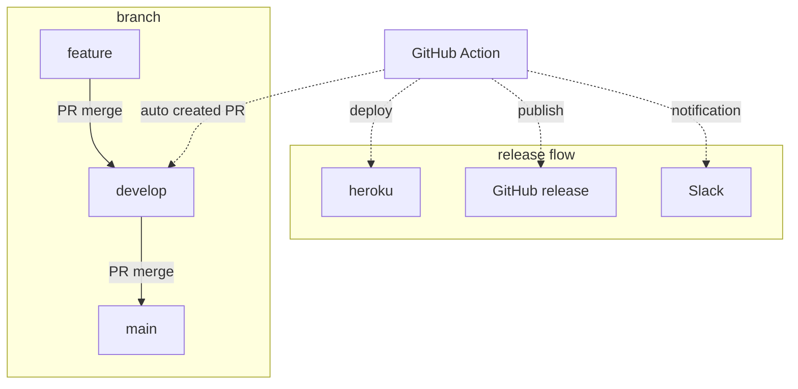

## 流れ

- 普段の開発はfeatureブランチで行う
- featureブランチからdevelopにマージすると、developからmainへのPRが自動作成される
  - PRには、どのfeature PRが今回のリリースに含まれるかを記載する
- 上記のdevelop→mainのPRをマージすると、それをトリガーにしてデプロイが行われる
- また、同時にGitHub releaseが行われて、タグが付けられる
  - リリース内容をSlackに通知する



（追記）
後から気づいたが、リリースのSlack通知に関しては[GitHubデフォルトのSlack通知](https://github.com/integrations/slack)でいい気がした。


## 使用した GitHub Actions

### [git\-pr\-release\-action](https://github.com/bakunyo/git-pr-release-action)

リリース用の PR を作成します。
マージ元とマージ先との差分の PR の情報を随時アップデートします。
[git\-pr\-release を実行する GitHub Action をつくってみた \- BAKUNOTE](https://blog.bakunyo.com/2019/02/26/github-actions-git-pr-release/)

### [release\-drafter](https://github.com/release-drafter/release-drafter)

前リリースとの差分 PR 情報を body に自動入力して release として公開します。
デフォルトではDraft PRを作成しますが、master push 時にしか使わないので、設定で公開するようにしています。
また、PRにラベルを追加することもできますが、今回は使っていません。

### [actions/checkout](https://github.com/actions/checkout)

指定のリポジトリやブランチに checkout します。
今回は`main`ブランチから heroku デプロイするために使いました。

### [heroku\-deploy](https://github.com/AkhileshNS/heroku-deploy)

heroku のデプロイに使っています。


### [slack\-github\-action](https://github.com/slackapi/slack-github-action)

Slack 通知に使っています。

`heroku-deploy`と`slack-github-action`では、アクセストークンが必要なので、リポジトリの Setting → サイドバーの Secrets → Actions から登録しておく必要があります。


## 実際の挙動


## 実際の yml

```yml:.github/workflows/git-pr-release.yml
name: Create PR to main

on:
  push:
    branches:
      - develop

jobs:
  git-pr-release:
    name: git-pr-release
    runs-on: ubuntu-latest
    timeout-minutes: 5
    steps:
      - uses: actions/checkout@v3
        with:
          fetch-depth: 0

      - name: git-pr-release
        uses: bakunyo/git-pr-release-action@v1.4
        env:
          TZ: "Asia/Tokyo" # タイトルの日時を +9 にするため
          GITHUB_TOKEN: ${{ secrets.GITHUB_TOKEN }}
          GIT_PR_RELEASE_BRANCH_PRODUCTION: main
          GIT_PR_RELEASE_BRANCH_STAGING: develop
          GIT_PR_RELEASE_LABELS: release
          GIT_PR_RELEASE_TEMPLATE: .github/RELEASE_PULL_REQUEST_TEMPLATE.md
```

```yml:.github/workflows/release.yml
name: Release

on:
  push:
    branches:
      - main
  workflow_dispatch:

permissions:
  contents: read

jobs:
  release:
    runs-on: ubuntu-latest
    timeout-minutes: 10
    permissions:
      contents: write # for release-drafter/release-drafter to create a github release
    steps:
      - uses: actions/checkout@v3
        with:
          ref: main

      - name: heroku_deploy
        uses: akhileshns/heroku-deploy@v3.12.12
        with:
          heroku_api_key: ${{ secrets.HEROKU_API_KEY }}
          heroku_app_name: hashlog # Must be unique in Heroku
          heroku_email: aiandrox7@gmail.com

      - name: Create Release
        id: create_release
        uses: release-drafter/release-drafter@v5
        with:
          config-name: release-drafter.yml
          disable-autolabeler: true
          publish: true
        env:
          GITHUB_TOKEN: ${{ secrets.GITHUB_TOKEN }}

      - name: echo release note
        id: get_release_note
        run: |
          # 改行コードをエスケープする
          release_body='${{ steps.create_release.outputs.body }}'
          release_body=${release_body//$'\r\n'/\\n}
          release_body=${release_body//$'\n'/\\n}
          echo "::set-output name=body::$release_body"

      - name: Send Release Note
        uses: slackapi/slack-github-action@v1.19.0
        with:
          payload: |
            {
              "text": ":rocket: ${{ steps.create_release.outputs.published_at }} ${{ steps.create_release.outputs.name }} Released!\n${{ steps.create_release.outputs.html_url }}\n```${{ steps.get_release_note.outputs.body }}```",
              "unfurl_links": false
            }
        env:
          GITHUB_TOKEN: ${{ secrets.GITHUB_TOKEN }}
          SLACK_WEBHOOK_URL: ${{ secrets.SLACK_WEBHOOK_URL }}

  # 失敗時の Slack 通知
  failure-notify:
    runs-on: ubuntu-latest
    needs: [release]
    if: failure()
    timeout-minutes: 5
    steps:
      - name: Send Failure
        uses: slackapi/slack-github-action@v1.19.0
        with:
          payload: |
            {
              "text": ":cry: Release Job Failure...\n${{ github.server_url }}/${{ github.repository }}/actions/runs/${{ github.run_id }}"
            }
        env:
          SLACK_WEBHOOK_URL: ${{ secrets.SLACK_WEBHOOK_URL }}
```

```yml:.github/release-drafter.yml
name-template: "v$RESOLVED_VERSION"
tag-template: "v$RESOLVED_VERSION"
exclude-labels:
  - "release"
categories:
  - title: "🚀 Features"
    labels:
      - "feature"
      - "enhancement"
  - title: "🐛 Bug Fixes"
    labels:
      - "fix"
      - "bugfix"
      - "bug"
  - title: "🧰 Maintenance"
    labels:
      - "chore"
  - title: "⚡ Improvements"
    labels:
      - "refactoring"
  - title: "📦 Dependencies"
    labels:
      - "dependencies"
change-template: "- $TITLE @$AUTHOR (#$NUMBER)"
change-title-escapes: '\<*_&' # You can add # and @ to disable mentions, and add ` to disable code blocks.
version-resolver:
  major:
    labels:
      - "major"
  minor:
    labels:
      - "minor"
  patch:
    labels:
      - "patch"
  default: patch
template: |
  ## Changes

  $CHANGES
```

## 参考

- [GitHub リリースページのドラフトを自動生成してくれる Release Drafter を導入する \- kondoumh のブログ](https://blog.kondoumh.com/entry/2021/03/26/151425)
- [GitHub ActionsでリリースノートをSlack投稿する \- Qiita](https://qiita.com/k-akie/items/95ce37b415ec681e1d79)
- [GitHub Actionsが失敗したらSlackに通知する with Slack Workflow \+ slack\-github\-action \- $shibayu36\->blog;](https://blog.shibayu36.org/entry/2022/01/24/170000)
- [Github Actionsでリリース対象確認とチェンジログ作成の作業を省力化する \| TSOne Tech Blog](https://www.tsone.co.jp/tech-blog/archives/1382)
- [GitHub Actionsで1つ以上のジョブが失敗した場合にSlackに通知する](https://zenn.dev/ntoy/articles/3e7521cd39a75b)
- [GitHub Actions Workflow チェックリスト \| CyberAgent Developers Blog](https://developers.cyberagent.co.jp/blog/archives/36423)
- [GitHub Actions のベストプラクティス](https://zenn.dev/snowcait/scraps/9d9c47dc4d0414)
