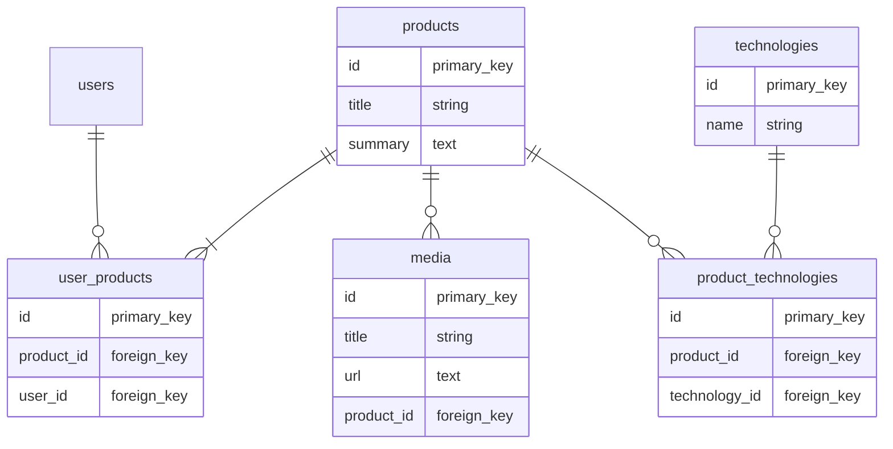

## はじめに

前提として、同様のことは`accepts_nested_attributes_for`を使えばできます。これはPOROっぽく実装したい人に向けた記事です。

これをフォームオブジェクトとするべきか、もはやモデルとみなすべきかは議論の余地がありますが、目標としてはActiveRecordの感覚で複数レコードの処理ができるクラスです。
前提として、このサンプルコードに登場するテーブルとアソシエーションは以下の通りです。




## ビュー

[【Rails】ネストされたattributes_paramsをフォームからコントローラに渡す]()と少し変わっていますが、大きな違いはないです。

```rb:app/views/products/_form.html.slim..rb
= form_with model: @product_form, do |f|
  = f.label :title
  = f.text_field :title

  = f.label :summary
  = f.text_area :summary

  = f.label :technology_ids
  = f.select :technology_ids, Technology.order(:id).pluck(:name, :id), { include_blank: 'なし' }, { multiple: true }

  / edit用
  - @product_form.media.each do |medium|
    = render 'medium_form', f: f, medium: medium

  / 追加レコード用
  - 2.times do |_i|
    = render 'medium_form', f: f, medium: Medium.new

    = f.submit
```

「追加レコード用」と書いている箇所は、JSなどで追加できるようにするとよいと思います。（[Turboでの実装例]()）
また、「edit用」と書いている箇所も、削除ボタンでフォームごと消せるようにしています。消したことを感知できるように、下記のfield_for内ではmediumのidを渡すようにしています。


```rb:app/views/products/_medium_form.html.slim..rb
= f.fields_for 'media_attributes[]', Medium.new, {} do |ff|
  = ff.hidden_field :id, value: medium.id

  = ff.label :title
  = ff.text_field :title, value: medium.title

  = ff.label :url
  = ff.text_area :url, value: medium.url
```


## コントローラ

コントローラの実装は以下のようになります。というか、ActiveRecordっぽく使えるようにメソッドをフォームオブジェクトで定義します。

```rb
class ProductsController < ApplicationController
  def new
    @product_form = ProductForm.new
  end

  def edit
    @product_form = ProductForm.find(params[:id], current_user.id)
  end

  def create
    @product_form = ProductForm.new(product_params.merge(user_ids: [current_user.id]))
    if @product_form.save
      redirect_to product_path(@product_form), notice: '投稿しました！'
    else
      render :new
    end
  end

  def update
    @product_form = ProductForm.find(params[:id], current_user.id)
    if @product_form.update(product_params)
      redirect_to product_path(@product_form), notice: 'データを更新しました！'
    else
      render :edit
    end
  end

  private

  def product_params
    params.require(:product).permit(
      :title,
      :summary,
      technology_ids: [],
      media_attributes: %i[id title url],
    )
  end
end
```

## フォームオブジェクト

### create用のメソッドを定義する

`ProductForm.new`でフォームから送られたparamsを過不足なくインスタンスのattributeとして持つようにし、`ProductForm#save`で**Productと紐づくMediumを作成**する。

```rb
class ProductForm
  include ActiveModel::Model
  include ActiveModel::Attributes

  attribute :id, :integer
  attribute :title, :string
  attribute :summary, :string
  attribute :technology_ids, default: []
  attribute :user_ids, default: []
  attribute :media_attributes, default: []

  validates :id, presence: true, if: :persisted?
  validates :title, presence: true, length: { maximum: 100 }
  validates :summary, length: { maximum: 500 }
  validates :user_ids, presence: true, if: :new_record?
  validate :media_validity

  delegate :persisted?, :new_record?, to: :product

  def save
    return false if invalid?

    save!
    true
  end

  def to_model
    product
  end

  def media
    media_attributes.map(&:deep_symbolize_keys).map do |attributes|
      Medium.new(**attributes, product: product)
    end
  end

  private

  def save!
    ActiveRecord::Base.transaction(joinable: false, requires_new: true) do
      product.save!
      media.each(&:save!)
    end
    # 作成成功時にself.idに値を入れるため。この記述がないと、`redirect_to product_path(@product_form)`が失敗する
    assign_attributes(id: product.id)
  end

  def product
    @product ||= Product.new(**product_params)
  end

  def product_params
    {
      title: title,
      summary: summary,
      technology_ids: technology_ids,
      user_ids: user_ids,
    }
  end

  def media_validity
    return if errors.any?

    media.select(&:invalid?).flat_map(&:errors).flat_map(&:full_messages).each do |full_message|
      errors.add(:media_attributes, "の#{full_message}")
    end
  end
end
```

`user_ids`や`technology_ids`はhas_manyを定義しておけばよしなに紐付いてくれるので、productのparamsに設定しておけば問題ないです。
関連: [Active Record の関連付け \- Railsガイド](https://railsguides.jp/association_basics.html#has-many%E3%81%A7%E8%BF%BD%E5%8A%A0%E3%81%95%E3%82%8C%E3%82%8B%E3%83%A1%E3%82%BD%E3%83%83%E3%83%89-collection-singular-ids-ids)

`media_validity`メソッドではmediaの値を検証します。何番目かの特定はしていないですが、エラーメッセージを出せればよいということにしています。


### edit用のメソッドを定義する

editでは`Product.find`を使い、既に登録されている値をフォームに入れます。

```rb
class ProductForm
  # 略

  class << self
    def find(product_id, user_id)
      user = User.find(user_id)
      product = user.products.find(product_id)

      new(**attributes(product))
    end

    private

    def attributes(product)
      product.attributes.deep_symbolize_keys.slice(
        :id,
        :title,
        :summary,
      ).merge(
        {
          technology_ids: product.technology_ids,
          user_ids: product.user_ids,
          media_attributes: product.media.map(&:attributes),
        },
      )
    end
  end

  # 略

  private

  def product
    @product ||= Product.find_by(id: id) || Product.new(**product_params)
  end

  # 略
end
```

`.find`内で`Product.find(product_id)`にしていないのは、自身以外のProductを取得できないようにするためです。

> 関連付けを使ってマイクロポストを見つけるようにしている点です。これにより、あるユーザーが他のユーザーのマイクロポストを削除しようとすると、自動的に失敗するようになります。
[第13章 ユーザーのマイクロポスト \- Railsチュートリアル](https://railstutorial.jp/chapters/user_microposts?version=5.1#code-micropost_partial_with_delete)

と同じことです。
この処理はコントローラ側でやってもいいような気もしますが、編集するとき以外にProductFormにアクセスすることはないので、ここに記述しています。

`.attributes`は以下のような返り値になります。

```rb
{:id=>25,
 :title=>"ほげ",
 :summary=>"",
 :technology_ids=>[2, 5, 6],
 :user_ids=>[22],
 :media_attributes=>
  [{"id"=>21,
    "title"=>"タイトル",
    "url"=>"https://example.com",
    "product_id"=>25,
    "created_at"=>Sat, 12 Nov 2022 16:20:24.067833000 JST +09:00,
    "updated_at"=>Sat, 12 Nov 2022 16:20:24.067833000 JST +09:00}]}
```

この値を使って、`ProductForm`インスタンスを作成し、`.find`の返り値とします。ちなみに、mediumの`created_at`と`updated_at`もそのまま入るが、特に使いません。


### update用のメソッドを定義する

updateメソッドでは、バリデーション・productに新しい値を保存・関連mediaに値を保存・削除されたレコードの削除を行います。この前2つに関しては新規作成時と同じように、assign_attributesで入力値を入れて検証することで満たせます。


```rb
class ProductForm
  # 略

  def update(params)
    assign_attributes(params)
    return false if invalid?

    product.assign_attributes(**product_params)
    save!
    true
  end

  def media
    return @media if defined?(@media)

    # ① 新たな値の適用
    present_media = product.media.index_by(&:id)
    @media = media_attributes.map(&:deep_symbolize_keys).map do |attributes|
      if attributes[:id].present? # 新しいフォームの値か、元のフォームの値かを確認する
        medium = present_media[attributes[:id].to_i]
        medium.assign_attributes(**attributes.slice(:title, :url))
        medium
      else
        # ③ product.media.build にはしない
        Medium.new(**attributes, product: product)
      end
    end
  end

  private

  def save!
    ActiveRecord::Base.transaction(joinable: false, requires_new: true) do
      product.save!
      product.media.where.not(id: remained_medium_ids).destroy_all # ② 作成されていないレコードを削除
      media.each(&:save!)
    end
    assign_attributes(id: product.id)
  end

  # 重複を返す
  def remained_medium_ids
    attr_medium_ids = media_attributes.map do |attr|
      attr.deep_symbolize_keys[:id]
    end.compact_blank.map(&:to_i)
    attr_medium_ids & product.media.ids
  end

  # 略
end
```

このときの`media_attributes`は以下のようになっています。

```rb
[2] pry(#<ProductForm>)> media_attributes
=> [{"id"=>"21", "title"=>"titleを変更", "url"=>"https://hoge.com"}, {"id"=>"", "title"=>"新しいmedium", "url"=>"https://hoge.com/new"}]
```

- titleまたはurlが変更されたもの
- 新規に追加されたもの
- 削除されたもの

フォームとハッシュはそのまま対応しているため、新規に作成されたものはidが`""`で、削除されたものはハッシュごと消えています。
このことを踏まえて、それぞれの値を適用します。


#### ① 新たな値の適用

`present_media`にハッシュを代入しているのは、mapの中でクエリを発行しないためです。
フォームまるごと新規レコードの場合はidが`""`なので、そこで判定します。新規レコードの場合は`Medium`インスタンスに値を入れます。

#### ② 削除されたレコードを削除

`remained_medium_ids`では、既存のproduct.mediaとフォームから入ってきた値とで重複しているmedium.idを返しています。product.mediaには存在しているが`remained_medium_ids`に存在しないものは、フォームから削除されたmediumということになります。


#### ③ product.media.build にはしない

この部分を`product.media.build(**attributes)`にすると、新しいmediumがレコードとして保存されなくなります。
これは、以下の流れによります。

```rb
product.save!
product.media.where.not(id: remained_medium_ids).destroy_all
media.each(&:save!)
```

`product.media`としてbuildされたインスタンスAは`product.save!`で一緒にsaveされます。

> `:autosave`を`false`に設定することと、`:autosave`オプションを未設定のままにしておくことは同じではありません。`:autosave`が存在しない場合、関連付けられたオブジェクトのうち、新しいオブジェクトは保存されますが、更新されたオブジェクトは保存されません。
[Active Record の関連付け \- Railsガイド](https://railsguides.jp/association_basics.html#has-many%E3%81%AE%E3%82%AA%E3%83%97%E3%82%B7%E3%83%A7%E3%83%B3-autosave)

`product.save!`の後に取得した`remained_medium_ids`には、新規作成したレコードのidも含まれてしまいます。なので、`product.media`に入らないように`Medium.new`でインスタンスを作成しておいて、mediaに関しては`media.each(&:save!)`で保存を行うようにしています。

ちなみに、`Product has_many :media, autosave: false`にするというのも対応方法としてはありです。


## i18n用のja.yml

エラー表示用に、ActiveModelのattributeにも日本語名を定義しています。

```yml
ja:
  activerecord:
    attributes:
      medium:
        title: 見出し
        url: URL
  activemodel:
    attributes:
      product_form:
        title: サービス名
        summary: 概要
        technology_ids: 使用技術
        media_attributes: メディア
```

## 終わりに

わりとオレオレのクラスなので、可読性が悪かったり不備などもあると思います。
もっといい実装方法があればご教示いただけると幸いです。
