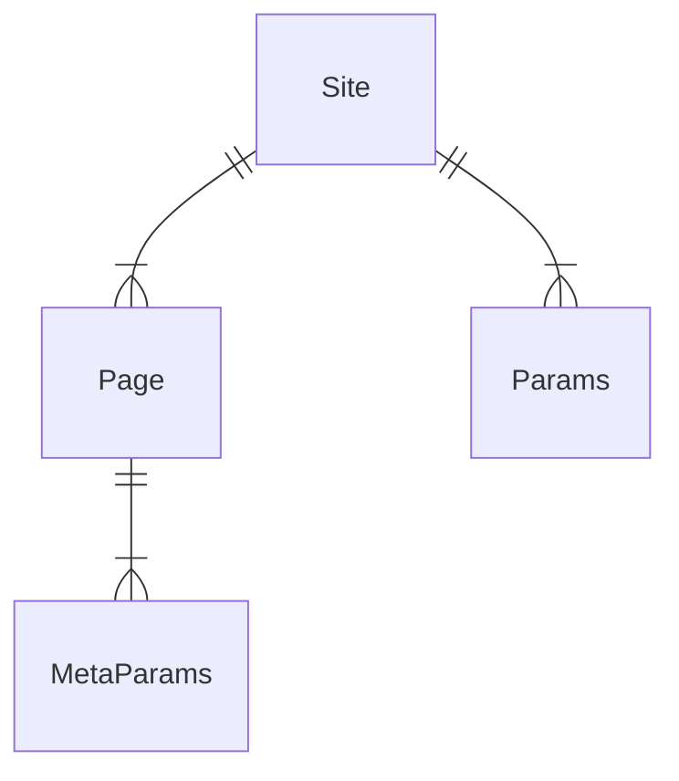

Hugoのhtmlを編集しようとして、文法が全くわからなかったので、ナニコレ？と思ったものを調べました。
Zzoのテンプレートをいじりながら調べていたので、純Hugoの文法ではないものも混ざっているかもしれません。


## configパラメータの取得方法

```toml:config/_default/config.toml
baseURL = "https://blog.aiandrox.com"
```

```toml:config/_default/params.toml
logoText = "blog.aiandrox"
```

このとき、`{{ $.Site.baseURL }}`または`{{ .Site.baseURL }}`でbaseURLを取得できる。
また、logoTextを取得する場合は、下記のように記載できる。

```
{{ $.Param "logoText" }}
{{ .Param "logoText" }}
{{ .Param "LOGOTEXT" }}
{{ $.Site.Params.logoText }}
{{ .Site.Params.logoText }}
{{ .Site.Params.LOGOTEXT }}
```


- `$`は省略できる。（ただし、意味はある。後述の`with`のため）
- 大文字小文字を区別しない。




`$.Param`は単体ではエラーになり、引数を渡すことで表示できる。
`wrong number of args for Param: want 1 got 0`

paramsの中でネストしている場合はチェーンにする↓↓

```toml:config/_default/params.toml
[telegram]
  enable = false
```

```
{{ .Site.Params.telegram.enable }}
{{ .Param "telegram.enable" }}
```

## md記事のメタデータを取得する

`{{ $ }}`は`Page(/posts/tech/2022/11/19.md)`を示す。
`{{ .Params }}`は以下のようなメタデータのmapである。

```go
map[categories:[Hugo] date:2022-11-24 00:00:00 +0000 UTC draft:false image:images/logos/hugo.png iscjklanguage:true lastmod:2022-11-24 00:00:00 +0000 UTC publishdate:2022-11-24 00:00:00 +0000 UTC series:[技術関連] tags:[Hugo] title:【Hugo】テンプレートの文法を勉強する]
```

以下の記述によって、`.md`のメタデータ`title`を取得できる。

```
{{ .Params.Title }}
{{ $.Title }}
{{ $.Param "title" }}
```

## `with`を使う場合

`with`のブロック内では`.`がwithの引数になる。
そのため、以下の`.`は`.Params.image`になる。このとき、ブロック内で`.Params.hoge`と記述すると、`$.Params.image.Params.hoge`を参照する。
なので、withブロック内では`$`を付けて絶対参照をするようにする必要がある。

```go
  {{ with .Params.image }}
    <meta property="og:image" content="{{ . }}">
    <meta property="og:image:url" content="{{ . }}">
    <meta name="twitter:app:name:iphone" content="{{ $.Site.Title }}">
    <meta property="twitter:title" content="{{ $.Param "title" }}">
  {{ end }}
```

## 参照

- [Hugoの基本文法チートシート【入門編】 · GizWoo](https://blog.gizwoo.com/hugo-basic-grammar/#and%E3%81%A8or)
- [Functions Quick Reference \| Hugo](https://gohugo.io/functions/)
- [Configure Hugo \| Hugo](https://gohugo.io/getting-started/configuration/)
- [Create Your Own Shortcodes \| Hugo](https://gohugo.io/templates/shortcode-templates/#params)
