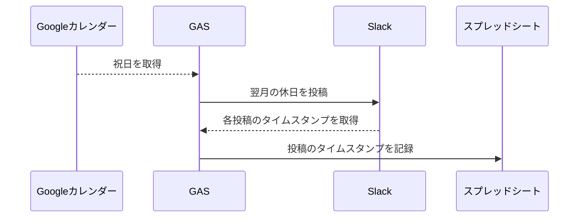
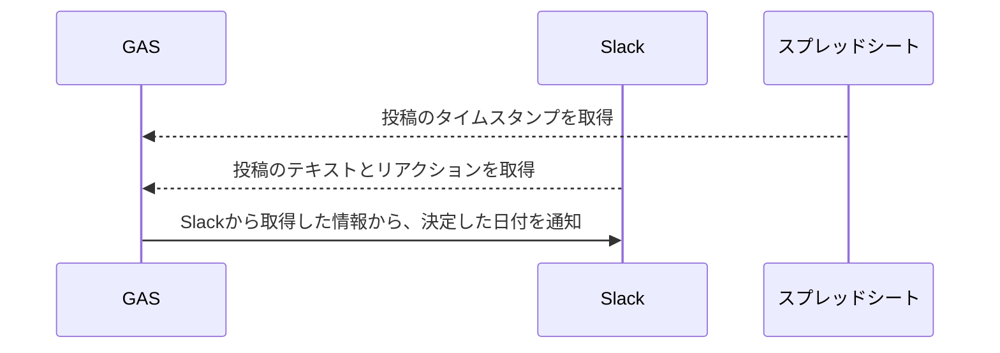

もともとLambdaでたなしょーが作ってくれていたのを、GASで作り直しました。

## 処理フロー

毎月10日に、翌月の休日をSlackに投稿します。

その月の20日に、集計結果から勉強会の日程とメンバーを確定します。

## 完成コード

https://github.com/aiandrox/gas/tree/main/runrun-script

## 参考

- [GAS：SlackのAPIを使ってメッセージのスレッドに投稿する方法 \| 知ってほしいWebのあれこれ](https://web-tweets.com/automation/slack-post-threads/)
- [Slack APIをGASで扱おうとしてハマった話](https://zenn.dev/activecore/articles/d9e4860891a7bd)
- [\[Googleスプレッドシート\]数字が日付や時間に変換されない様にする方法｜数式もそのまま表示 \| liquidjumper](https://liquidjumper.com/application-netservice/googlespreadsheet_disable-the-number-display-format#headline)
