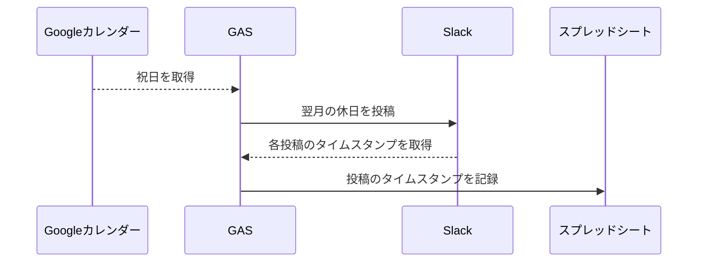
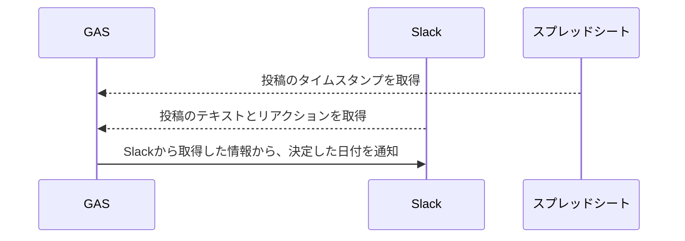

こういうやつを作りました。もともとLambdaでたなしょーが作ってくれていたのを、GASで作り直しました。

## 処理フロー

## 完成コード

https://github.com/aiandrox/gas/tree/main/runrun-script

## 参考

- https://web-tweets.com/automation/slack-post-threads/
- https://zenn.dev/activecore/articles/d9e4860891a7bd
- https://liquidjumper.com/application-netservice/googlespreadsheet_disable-the-number-display-format#headline
